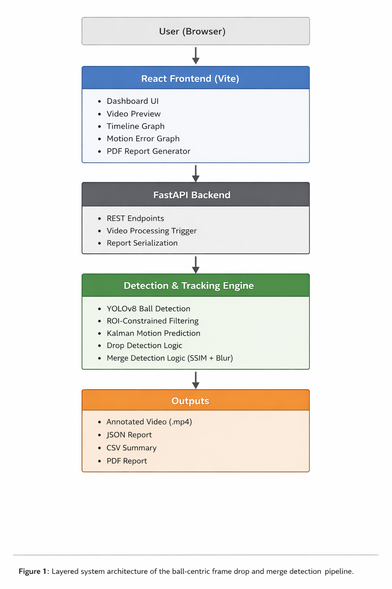

# Pragyan_khel  
**Ctrl+Shift | Pragyan NextGen Hackathon 2026 | PS2 — Frame Drop / Merge Detection**

# Ball-Centric Frame Drop & Merge Detection System

---

## 🧠 Problem Statement

Professional cricket broadcasts can suffer from **frame drops** and **frame merges**, corrupting the temporal continuity of the video stream.

In high-stakes environments like DRS review, even a single dropped or merged frame near ball contact can change interpretation.

Timestamp-based detection is unreliable because broadcast pipelines often interpolate or re-stamp frames during encoding.

Instead of trusting metadata, we trust physics.

A cricket ball follows predictable motion. If its trajectory suddenly violates physical continuity, the video stream has likely been corrupted.

---

## 🎯 Core Idea

The system performs **ball-centric temporal consistency analysis** using motion prediction and visual anomaly detection.

Each frame is automatically classified as:

- **Normal**
- **Drop**
- **Merge**

The output includes:

- Annotated video
- JSON report
- CSV report
- Interactive dashboard
- PDF report export

---

## ⚙️ Approach

### 1️⃣ Ball Detection (YOLOv8)

A fine-tuned YOLOv8 model detects the cricket ball in each frame.

### 2️⃣ ROI-Constrained Tracking

Detection is restricted to a motion-based Region of Interest around the predicted ball position to reduce false positives.

### 3️⃣ Motion Prediction (Kalman + Velocity Model)

Ball position is predicted using motion history.  
Large deviation between predicted and detected position signals potential frame drop.

### 4️⃣ Frame Drop Detection

If motion error exceeds an adaptive gating threshold, the frame is classified as **Drop**.

### 5️⃣ Frame Merge Detection

Merge frames are detected using:

- Structural Similarity (SSIM)
- Laplacian variance (blur analysis)
- Confidence filtering

High similarity + reduced sharpness indicates frame blending.

---

## 🏗️ System Architecture

```
Video Input
      │
      ▼
YOLOv8 Ball Detection
      │
      ▼
ROI-Constrained Tracking
      │
      ▼
Motion Prediction (Kalman)
      │
      ▼
Drop & Merge Analysis
      │
      ▼
Annotated Video + JSON/CSV + PDF Report
```



---

## 🚀 Key Features

- Ball-specific anomaly detection  
- ROI-based motion stabilization  
- Kalman-filtered trajectory prediction  
- SSIM-based merge detection  
- Structured JSON/CSV reporting  
- Interactive React dashboard  
- GPU acceleration (optional)

---

## 🧪 Demo Mode Execution

This project runs in **Demo Mode**.

A pre-configured sample video is automatically processed.  
No file upload is required.

---

### 1️⃣ Backend Setup

```bash
cd ps2/release/backend

python -m venv venv
venv\Scripts\activate      # Windows
pip install -r requirements.txt

uvicorn main:app --reload
```

---

### 2️⃣ Frontend Setup

```bash
cd ps2/release/frontend/my-app
npm install
npm run dev
```

Frontend runs at:

```
http://localhost:5173
```

---

### 3️⃣ Run the System

Open:

```
http://localhost:5173
```

Click **Run Analysis →**

The system will:

- Process the demo video
- Generate annotated output
- Display analytics graphs
- Allow CSV / Video / PDF export

---

## 📁 Repository Structure

```
ps2/
 ├── release/        → Final working hackathon build
 │   ├── backend/    → FastAPI + YOLO detection engine
 │   └── frontend/   → React + Vite dashboard
 ├── scripts/        → Experimental development scripts
 └── core/           → Supporting modules
```

Only `ps2/release/` represents the final submission pipeline.

---

## 🌍 Real-World Applications

- DRS integrity validation  
- Broadcast quality assurance  
- Sports analytics pipelines  
- Automated video corruption detection  

---

## 👥 Team

**Ctrl+Shift**  
Pragyan NextGen Hackathon 2026